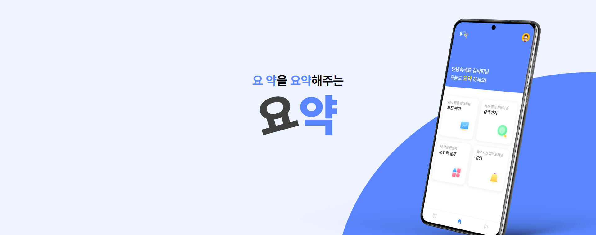

# 💊 요약 - 요 약을 요약해주는 앱

# 🌟 서비스 소개

이 약이 뭐였더라 잊어버린 적 있으신가요?
빽빽한 주의사항 꼼꼼하게 읽고 계신가요?

저희는 약을 이미지로 촬영하여 AI를 통해 어떤 약인지 정보를 알려주고,
약에 대한 정보를 요약해서 알려주고자 시작했습니다.

요약에서 약 정보를 얻어보세요!

# 💡 주요 기능

### 사진으로 필터로 알약 검색

-   사진을 촬영하거나 이미지를 선택할 수 있어요.
    -   여러 개의 알약을 인식할 수 있어요.
    -   인식한 결과를 통해 알약 상세 보기를 할 수 있어요.
-   알약의 모양, 색, 제형과 같은 특징으로 검색할 수 있어요.
-   알약 전문 검색을 통해 검색할 수 있어요.

### 요약해주는 알약 상세 정보

-   LLM을 통해 요약한 알약 정보를 한 줄로 알려드려요.
-   알약의 효능효과, 사용법, 주의사항을 볼 수 있어요.
-   저장하기를 통해 약 봉투에 저장하고 다시 볼 수 있어요.

### 돌보미를 통한 가족 관리

-   부모님, 자녀, 애완동물 등 돌보미를 추가할 수 있어요.
    -   돌보미의 이름, 나이, 병력 등 정보를 입력할 수 있어요.
-   약 봉투, 알림에서 돌보미 별로 정보를 볼 수 있어요.

### 복용 알림 설정 및 푸시 알림

-   복용 알림을 생성하고 시간에 따라 푸시 알림을 보내드려요.
-   알림에 복용 여부를 기록할 수 있어요.
    -   복용한 경우 복용 시간을 기록할 수 있어요.
    -   복용하지 않은 경우 건너뛰기로 표시할 수 있어요.

### 챌린지를 통해 꾸준히 약 먹기

-   챌린지를 통해 자신이 약 먹기 정보를 진행 바를 통해 확인할 수 있어요.
-   다른 사람의 챌린지를 둘러보고 응원하기를 통해 동기부여를 할 수 있어요.

# 🛠️ 주요 기술 스택

-   Infra : AWS, Jenkins, Docker, Nginx
-   BackEnd : Java, Spring, JPA, Python, FastAPI
-   FrontEnd : Dart, Flutter, Next.js
-   DataBase : MySQL
-   Etc : AmazonS3, Firebase, Elastic Search, Git, SonarQube
